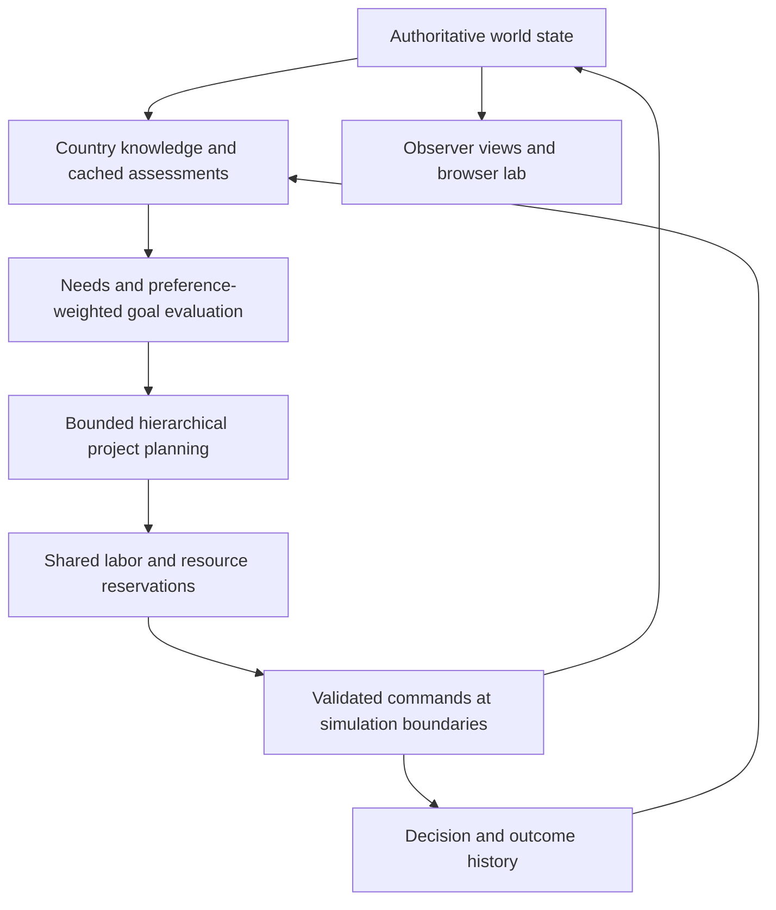

# Game AI for Chronicle

Chronicle should retain Utility AI and terrain-aware search, but the complete country simulation needs a layered architecture: a country-specific view of the world, persistent priorities, bounded planning, resource reservations, and authoritative execution. A single behavior tree or pathfinding library will not supply this architecture. Randomly generated countries can share the same decision machinery while differing in their circumstances, preferences, knowledge, institutions and remembered experiences.

The recommended foundation is **utility-based strategic choice, hierarchical projects, and a deterministic simulation-owned command executor**. Evaluate **XState** for the lifecycle of those projects; use **TinyQueue** for weighted frontier search and **fast-check** for generated regression scenarios. Evaluate **pure-rand** when introducing country/subsystem random streams. These are adoption recommendations, not dependencies installed in the Chronicle application. Preserve the current TypeScript core, worker authority, SQLite checkpoints and browser lab.

This report records the research baseline before adoption; [Country AI 01](features/country-ai-01.md) tracks subsequent implementation decisions and verification. This assessment concerns the repository at `943587c` and sources checked on 11 September 2026. Package publication dates are observations, not guarantees of maintenance or suitability. The survey covers directly compatible libraries, established game implementations, alternative planning methods and supporting tools; it does not claim to enumerate every library. The first release remains tribal-to-medieval, with runtime language-model calls and individual-person simulation excluded by the specification. Later industrial resources are architectural examples rather than an expansion of the release scope.[^1]

**Requirements that determine the architecture**

The product specification describes an autonomous historical simulation, rather than a competitive AI with a single victory condition. Countries must survive, develop, form relationships, sometimes fail, and leave explanations. Optimizing territorial size alone would conflict with viable small states, consolidation, subject relationships, cultural persistence and resource-dependent development.[^1]

| Chronicle requirement | Consequence for game AI |
|---|---|
| Hundreds of founding tribes on a large world | Share algorithms and immutable geography; bound work per decision and avoid one actor or graph per cell |
| Distinct, reproducible countries | Persist generated profiles, knowledge, plans and random-stream state; keep rules and content versioned |
| Capital-centered exclusive claims | Ownership is authoritative state; frontier search proposes legal adjacent claims |
| Villages within the country's region | Settlement opportunities are evaluated inside accessible holdings; settlement work areas do not create sovereignty |
| Food, labor and materials constrain action | Plans reserve actual inputs, then execution accounts for consumption, transfers and failure |
| Technology changes capabilities | Separate discovery, knowledge, adoption, extraction and usable inventory |
| Culture, religion, institutions and succession | Country policy can respond to aggregated internal interests; personality is not the whole society |
| Trade and diplomacy through contact | AI receives known partners, reachable routes and permissions, not unrestricted observer knowledge |
| Conquest and successor states preserve identity | Canonical transactions transfer holdings and reconcile people, inventories, projects and relationships |
| Large states may endure or fragment | Administration creates costs and choices, not a forced collapse timer |
| Explainable history | Capture evaluated reasons when decisions happen; do not reconstruct them from later state |
| Monthly playback and saved continuation | Daily mechanics and scheduled decisions use simulation time; rendering and wall-clock scheduling do not change outcomes |

The latest country-design correction takes precedence over older passages that make a formal province mandatory at tribal founding. The next ownership contract should explicitly represent pre-province country claims, then define how provincial ownership becomes authoritative for member cells. Two independently editable ownership fields would create contradictions. This report recommends resolving that contract in the next implementation brief; it does not silently migrate existing saves.[^1][^2]

Current implementation is much narrower: one identity per session, 250 fixed people, deterministic food and settlement behavior, and a monthly host clock. The three-community plateau is a consequence of transferring 80 people per founding from a parent requiring 160. None of the candidate AI libraries adds population growth, productive employment, research or new needs automatically. Improving decisions requires supplying the mechanics and choices they can act on.[^3]

**Randomness, identity and adaptation**

A useful country model has several sources of variation. Geography determines opportunities and barriers. A separately seeded population/identity setup determines starting circumstances. A small generated preference profile affects choices among reasonable alternatives. Knowledge and history determine which options are even considered. Institutions, shortages, leadership changes and contact can modify policy over time.

Start with a manageable profile such as risk tolerance, reserve preference, expansion preference, openness to unfamiliar practices and preference for centralized administration. These are proposed design dimensions, not scientific claims about human populations. They should influence trade-offs rather than grant free resources or guarantee a historical destiny. Avoid assigning every country an independent random value for dozens of poorly understood parameters: that is difficult to balance and often produces incoherent behavior.

A cautious state and an ambitious state can both value food security. The cautious one might require a larger reserve before a frontier project, while the ambitious one accepts a smaller margin. A severe shortage should override both preferences. A coastal country may find fishing and transport attractive because of its circumstances; it need not have a permanently assigned “naval civilization” category. When the economy changes, its useful opportunities should change too.

Use randomness sparingly at meaningful decision points: sample initial preferences once, resolve close alternatives through bounded seeded selection, and sample explicitly modeled uncertain events. Preserve commitment to an ongoing project unless conditions materially change. Separate entry/recovery thresholds and switching costs prevent constant plan oscillation. Pure randomness each month would make countries difficult to recognize and undermine the inspector's explanations.

The current browser samples a fresh spawn seed and saves it; the geography seed alone therefore does not reproduce a newly spawned country's complete identity and placement. A future reproducible world setup should record geography seed, society seed, rules/content version and any explicit placement. Save independent country/subsystem RNG state or use a reviewed keyed-event scheme. Merely installing a seeded generator does not fix changing iteration order or undocumented random calls.[^2][^3]

The longer-term society model should distinguish population groups, government policy and any future leadership traits. Culture and religion can cross political borders. A merger should preserve groups and founding lineage; succession may change leadership priorities while preserving institutional commitments. This permits meaningful internal variation without simulating every person or making a country a single immutable personality.

**A layered decision architecture**

The following is a proposed Chronicle design, informed by utility and hierarchical planning literature. It separates choosing an objective from finding and executing a way to achieve it. Utility methods score alternatives; HTN planning decomposes an abstract task into smaller tasks and can consider the effects of those tasks. Neither decides Chronicle's resource laws or supplies its game content.[^4][^5]

Country knowledge should include reachable known sites, estimates of neighboring conditions and its own verified inventories. The atlas may show every deposit to the observer while the country cannot exploit or value unknown ore. Observed facts need source, age and confidence where uncertainty matters. An estimated gain can be wrong; accounting and access checks must still be correct.

Strategic evaluation compares a bounded set of objectives: secure food, replenish reserves, expand a useful frontier, develop a resource, improve access, or consolidate administration. Later domains add research, defense and diplomacy. Use interpretable normalized considerations and hard eligibility filters. Prevent starvation through a critical-needs policy rather than hoping its score always outweighs every attractive resource. Utility scoring also needs a time horizon: an immediate-cost action can be worthwhile because it removes a persistent shortage.

Hierarchical projects describe alternative methods. “Improve food security” might decompose into reallocating labor, improving accessible production, claiming fertile neighboring land, founding a supported village, or eventually importing food. Each method has prerequisites, estimated costs, a duration and a completion condition. Initially a few authored methods are enough; deeper decomposition can grow alongside production chains. A behavior-tree sequence executes authored steps, while an HTN planner reasons over a task domain. They are related but are not interchangeable features.

A shared allocator decides which projects can proceed together. It coordinates reservations against identified local stockpiles and workforces, with feasible delivery routes, time and capacity; it does not turn national ownership into a globally spendable inventory. A country may maintain a research effort while preparing a settlement, but they cannot both reserve the same workers or timber. Represent available, reserved and consumed quantities separately. Reservation is not consumption; workers assigned to frontier support remain living people and leave less labor for production. Cancellation releases unspent reservations and records explicit sunk costs. Failed delivery or interrupted construction must not duplicate goods on retry.

Execution submits canonical commands to the same authoritative simulation used by the lab. Validate again at execution because another actor may have claimed a site or a route may have become inaccessible. Successful commands produce actual state changes and decision records; the AI cannot directly edit ownership arrays or invent production effects. Persist project identity, chosen target, phase, progress, reservations, next review date and cancellation reason. This is also the state needed for exact resume after a host restart.

Keep a small number of concurrent strategic projects initially. A country should not stop eating while it researches, but it also need not re-evaluate every settlement and research option every day. Routine production can run daily; strategic review can run monthly or after important events, consistent with the spec's proposed scheduling. All countries share a world timeline. Budget expensive search by node expansions or candidate count, not a variable millisecond cutoff that changes the chosen action with machine load.[^1]

**Which decision methods fit**

| Method | Strength for Chronicle | Main limitation | Recommendation |
|---|---|---|---|
| Utility AI | Balances needs, opportunities, risk and preferences | Greedy scores alone miss dependencies and can oscillate | Use for goal/method prioritization with commitment and hard constraints |
| Hierarchical task networks | Reusable, structured plans with alternative methods | Domain authors must encode useful decompositions; search still needs limits | Design projects hierarchically now; add bounded planning as dependencies appear |
| Behavior trees | Clear reactive execution, guards and interruption | Do not inherently plan future effects or persist full running state | Optional local executor, subject to a save/replay adapter |
| Statecharts | Explicit project phases, failure and recovery | Do not choose objectives or synthesize plans | Strong candidate for durable project lifecycle |
| GOAP | Finds chains through action prerequisites/effects | Large numeric/spatial action spaces can make search expensive | Evaluate within bounded production or logistics subdomains later |
| BDI | Useful separation of beliefs, desires and committed intentions | Still requires selection, planning, execution and accounting rules | Adopt the conceptual distinctions; a BDI library is optional |
| MCTS | Compares possible futures using repeated simulated continuations | Needs a fast forward model and meaningful evaluation; large branching factor | Later experiment for bounded strategic disputes or campaigns |
| Reinforcement learning | Can discover effective policies from experience | Requires training infrastructure, stable environments and carefully designed rewards | Research option after the simulator and evaluation suite mature |

GOAP's action-model approach and HTN's domain decomposition are established game-AI techniques, but importing a planner does not supply the actions or their effects.[^5][^6] MCTS is applicable to strategy games, with documented practical pitfalls; it is not disqualified by the genre. For Chronicle's present stage, long-run state cloning and a missing mature forward model make it a more expensive first foundation.[^7]

AlphaStar demonstrates the power of learned strategy policies using imitation learning, reinforcement learning and a league of opponents. It is evidence of feasibility, not evidence that adding a machine-learning package produces a suitable country simulator. Chronicle prioritizes inspectable history and varied plausible societies rather than a single competitive ranking.[^8] PettingZoo supplies multi-agent RL environment interfaces, not a ready-made country AI; adopting it would require a Python-facing environment and an explicit training project.[^9]

**Libraries and adoption decisions**

Versions below are the stable npm releases observed during this assessment, where shown. “Candidate” means suitable for a scoped integration trial, not fully validated with Chronicle saves, workers or late-game loads. Small publication gaps can be consistent with a stable small utility; they are not, by themselves, proof of abandonment.

| Library | Observed version / license | Appropriate role | Decision |
|---|---|---|---|
| TinyQueue | 3.0.0 / ISC | Priority queue with a custom comparison function | Preferred initial queue candidate; explicit cost/ID tie order |
| FlatQueue | 3.1.0 / ISC | Compact numeric-priority queue | Benchmark alternative; equal-priority order is not guaranteed |
| pure-rand | 8.4.2 / MIT | Seeded generators, state restoration and stream separation | Candidate for new AI RNG contracts; preserve legacy replay |
| fast-check | 4.10.0 / MIT | Generated properties, shrinking and replayable action sequences | Strong next testing dependency |
| XState | 5.32.6 / MIT | Project lifecycle statecharts and persisted snapshots | Preferred executor to trial; use simulation events and adapter-owned state |
| Mistreevous | 4.3.1 / MIT | Behavior trees, guards, injected time/RNG and inspection | Conditional alternative; exact running-state resume needs additional work |
| Yuka | 0.7.8 / MIT | Broad goal/state-driven AI, graphs, movement and perception | Useful reference/optional subsystem; not the country-core default |
| JS-son (`js-son-agent`) | 0.0.17 / BSD-2-Clause | Belief/desire/intention reasoning | Relevant conceptual reference; limited direct infrastructure benefit |
| GamePlanHTN | 1.0.1 / MIT | Forward hierarchical task decomposition | Reference/prototype; cancellation, durable saves and search budgets need work |
| `goap` / Neloreck `goap-ts` | 1.1.1 / MIT; source-only TS candidate | Small GOAP implementations | Screened out as foundational dependencies; packaging and persistence gaps |
| Mahler | 4.1.5 / Apache-2.0 | TypeScript HTN task composition | Reject for new adoption: maintainer marks it unmaintained |
| ngraph.path | 1.6.1 / MIT | General graph pathfinding | Candidate for later route graphs; assess whole-grid memory first |
| EasyStar.js | 0.4.4 / MIT | Incremental grid A* | Secondary candidate; world wrapping and geographic distances need adaptation |
| bitECS | 0.4.0 / MPL-2.0 | Entity/component storage and queries | Profile first; ECS is a data-layout choice, not decision intelligence |
| HiGHS JavaScript/WASM | MIT project; release not audited here | Constrained production/allocation optimization | Later economy experiment, not an immediate country-brain dependency |
| Mesa | Apache-2.0, Python | Agent-based model experimentation and analysis | Reference/analysis tool; do not create a second authoritative simulator |
| CrashKonijn GOAP | Apache-2.0, Unity/C# | Established GOAP tooling | Reference implementation; not a drop-in Node library |

The queue, RNG and testing candidates have small, direct responsibilities. TinyQueue's comparator can preserve deterministic ties; FlatQueue explicitly does not promise stable equal-priority order. Prefer the clearer comparator first, then measure any need to change it. Geographic ownership cannot be delegated to a queue, graph or Voronoi tessellation.[^10][^11]

pure-rand provides deterministic generators and explicit state access. Its adoption would change random sequences, so keep legacy RNG behavior for old save versions or introduce an explicit migration rule. Partition streams by subsystem and stable actor identity. Restore and validate complete generator state, not just an initial seed; restarting a seed would repeat past randomness.[^12]

fast-check is especially valuable for this simulation's ownership and accounting rules. Its command generators can shrink a long failing interaction into a smaller reproducible sequence and report the replay information. Use it alongside Node's existing test runner. The reference model should track simple ownership or ledger invariants, not recreate a second settlement simulation.[^13]

XState should be trialed for persistent projects rather than installed as a scheduler for every cell. A statechart can represent proposed, funded, preparing, travelling, executing, completed and cancelled phases. Chronicle should provide dated simulation events and retain its resource ledger outside the state machine. Persisted snapshots do not automatically make external side effects transactional or provide Chronicle's schema migration policy. Restored invocations restart, while completed entry actions do not rerun; keep authoritative projects on synchronous domain events and exclude promise/async invocations from the initial trial. The recommendation concerns the tested v5 release; the live documentation now also advertises v6 alpha, so version-pinned source and experiments govern API conclusions.[^14]

Mistreevous offers injected behavior randomness and time plus a useful tree inspector. Its package also creates node identifiers through unseeded `Math.random`, and its inspection output is not a complete snapshot of wait progress or random choices. This does not prove all its action choices are nondeterministic; it does mean a deterministic save contract cannot simply serialize the inspector tree and assume exact continuation. A Chronicle-owned project record or a tested adapter is necessary.[^15]

Yuka supplies real reusable AI functionality, including goals and graph search, but much of its API concerns autonomous moving entities. Its broad JSON support must not be confused with a complete save of arbitrary custom goals and their mutable progress. Its published package is older than the other leading executor candidate; assess source fixes and application-specific goal serialization before depending on it.[^16]

JS-son's belief/desire/intention model maps well to distinguishing knowledge, aspirations and commitments. However, its reasoning loop still requires application-defined plan behavior and persistence. Mahler is more directly a TypeScript HTN planner, but the observed npm deprecation and archived repository make it a poor new foundation despite a promising older README.[^17][^18]

ngraph.path and EasyStar.js address navigation, not territory economics. Chronicle already has terrain-cost traversal over its cells. Keep geography in shared arrays and generate neighbors on demand; measure an explicit graph before allocating nodes and edges for the entire 524,288-cell world. Later settlements/ports/roads may justify a smaller high-level route graph. A* heuristics must remain valid under the actual movement costs and horizontal wrapping; use Dijkstra when an admissible heuristic is not established.[^19][^20]

bitECS is a possible optimization for large entity workloads; adopting it now would require translating existing IDs, storage and contracts. It cannot compensate for scanning the whole map per country. HiGHS can solve constrained allocation problems, but introduces a WASM solver lifecycle and numerical/modeling choices; use it only if real production-allocation measurements justify a solver. Mesa and Unity-based GOAP tools require different runtime environments, so their models and design lessons are more immediately useful than direct integration.[^21][^22][^23][^24]

GamePlanHTN is a closer algorithmic match than a movement-oriented engine: it supplies hierarchical decomposition and partial plans. However, its inspected primitive cancellation method is unfinished, partial-plan continuation is in memory, and no complete durable restore or search-budget interface was established. The small `goap` package and Neloreck's `goap-ts` repository likewise did not establish a maintained, typed, durable planning foundation. These package findings do not invalidate HTN or GOAP as methods; they support keeping the first hierarchical project domain small and Chronicle-owned.[^28]

**Lessons from functioning strategy-game AI**

Established strategy games are valuable references because they have already faced the interaction between production, planning and expansion. Their policies remain tied to their own rules, information and victory conditions; wholesale transplantation would not yield Chronicle's behavior.

**0 A.D.'s Petra AI** separates priorities, queued plans and resource accounts. Its queue manager handles affordability and even documents the risk of splitting resources across projects until none can start. Chronicle should adopt the lesson of shared reservations, completion-aware funding and emergency reprioritization. Its generated aggression/defense/cooperation settings also illustrate bounded personality variation. Petra is tightly coupled to its engine; the examined GitHub mirror is archived historical source, not a maintained Node package. Its GPL-2.0-or-later source is a design reference here.[^25]

**Freeciv** coordinates city production and technology priorities through game-specific advisors and desirability values. Its research code propagates value through prerequisites and considers the cost of switching research. Those are useful patterns for a country deciding between immediate survival and a longer technological project. Some evaluations temporarily mutate and restore state; Chronicle should instead use isolated projections to protect its authoritative simulation. Freeciv's GPL-2.0-or-later implementation is also a reference, not a compatible library.[^26]

**Unciv** combines domain automation with configurable personality preferences. Its official documentation acknowledges that some personality fields are incomplete, so the presence of a trait in a schema is not proof of meaningful behavior. Its AI-testing guide advocates automated repeated games and comparison statistics. Chronicle should adapt that practice to survival, prosperity, diversity and intelligible failure rather than win rate alone. Unciv is a Kotlin game under MPL-2.0; reuse of ideas is immediately useful, while copying implementation would require a separate integration and license assessment.[^27]

Together these examples favor shared decision infrastructure with domain-specific policies, persistent commitments and empirical balancing. The proposed Chronicle architecture draws from these patterns; it is not a claim that the three games implement the same hybrid planner.

**Territory and the economy must remain authoritative**

Treat each claim as an economic commitment. The capital has an initial legally owned region; growth considers frontier cells with a valid connection. Estimate the useful land or known resource gained, one-time expenditure, continuing support labor, accessible route cost and exposure to future shortages. Choose from this frontier rather than redrawing the country's entire region each month. A soft preference for compactness can discourage thin tendrils, but must not silently move other owners' cells or eliminate meaningful coastlines and holes.

A country is a neighbor when actual claimed cells share an allowed border relationship. Foreign cells fail ordinary movement and claiming checks. Future diplomatic access may authorize traversal without granting ownership; war changes the available actions, not the meaning of every pathfinding edge. Resolve competing claims once under an explicit deterministic policy. Avoid a permanent advantage caused solely by array order, while retaining reproducibility and a clear reason for the outcome.

Before adding provincial government, represent claims through one authoritative holding model. Later provincial membership and sovereignty need canonical transitions consistent with the already agreed provincial-capital capture rule. Settlements, worked areas, claimed land, administrative reach, military control and population density remain different facts. The national outline should render owned cells; it should not substitute for the ownership model.[^1][^2]

Resource discovery should not be omniscient. For any site, distinguish that it exists, that the country knows about it, that technology permits extraction, that access and workers make extraction possible, and that output has reached a usable stockpile. The AI may pursue a known prerequisite, but cannot forecast benefits from every hidden deposit. At first, implement only the resources with real collection and consumption mechanics. Later chains can give salt, metals or other goods meaningful roles.

Overextension should have an explicit mechanism: support labor reduces productive labor, supply consumes goods, distance raises delivery cost, and poor administration limits effective control. A worsening position can cause a halt, cancellation, reallocation or later governed abandonment. Avoid an unexplained universal “expansion points” balance unless it represents a defined capacity. A missing worker is not a dead person; withdrawal and abandonment require explicit accounting and territory lifecycle rules.

**Scaling and reproducibility**

Hundreds of countries do not require hundreds of operating-system workers. Keep one ordered authority per world and profile its decisions. If workers later evaluate plans in parallel, they should read immutable snapshots and submit proposals; the authority resolves conflicts deterministically. Parallel completion order must not decide which country receives a contested cell.

Maintain incremental frontier sets, known-resource indexes, country/region summaries and cached access calculations. Recompute a route when ownership, movement capability or infrastructure invalidates it. In the worst case, scanning 524,288 cells for each of 500 countries would already mean 262,144,000 cell visits in one review cycle, before evaluating any plans. That arithmetic is a warning about algorithm shape, not a measured Chronicle runtime.

Use a bounded candidate shortlist, coarse-to-fine planning and predictable review schedules. Record unfinished planning progress if a search spans simulation steps, or restart from a deterministic request snapshot under a defined budget. Plan budget exhaustion must leave a safe existing policy in force. Avoid allocating object-heavy copies of the full planet for every alternative future.

Measure early, settled and distressed worlds. Useful outputs include decision evaluations per simulated month, candidates generated/pruned, search-node expansions, active projects, reservation conflicts, route-cache hit rate, checkpoint size, heap growth and p50/p95/p99 batch latency. Existing geography and tiny-checkpoint benchmarks do not establish late-game country capacity. The spec asks for actual throughput measurements rather than a promised acceleration multiplier.[^1][^2]

Keep gameplay time as explicit integer dates and durations. Preserve stable iteration and comparison rules, bounded numeric ranges and rounding policy. Record rules/configuration and any library-sensitive plan representation in the save version. A generated profile must remain unchanged on reload; unrelated rendering work must consume no simulation randomness. The observed UI month remains thirty daily steps, not a larger probability jump.

**Testing intelligence, variety and balance**

Correctness, behavior quality and performance need separate evidence. An AI can choose a legal action that feels foolish, or make an appealing decision using duplicated resources. The lab should display both actual state and recorded reasoning: the selected objective, top alternatives, eligibility failures, estimated benefits, committed costs, progress and reason for reconsideration.

| Scenario | Required evidence |
|---|---|
| Same world/setup/profile seeds | Exact continuation across pause, playback batching and save/reload |
| Interrupted funded village project | Reservations and remaining work restore; no duplicate settlers or goods |
| Two projects need the same scarce material | Only supportable commitments are admitted; starvation of lower-priority work is visible |
| Foreign border or blocked sea crossing | Ordinary claims and movement are rejected before scoring and at execution |
| Unknown ore deposit | No site-specific attraction or knowledge of its hidden contents appears |
| Known ore without extraction capability | May motivate a prerequisite project; no extraction or finished products appear before technology, inputs and access permit them |
| Food crisis during expansion | A recorded reassessment changes commitments; actual costs remain accounted |
| Productive small country | Consolidation can remain viable without compulsory expansion |
| High administrative burden | Clear upkeep pressure and recovery choices; no age/size deletion trigger |
| Changed policy preference, same circumstances | Controlled experiments show interpretable behavioral differences |
| Same preference, different geography | Decisions respond to available opportunities rather than a fixed script |
| Merger, conquest or successor creation later | IDs/history persist appropriately; people, reservations and goods reconcile |

Use small synthetic geography fixtures for targeted boundaries while exercising the real core. Add property-based sequences for claims, cancellation, transfers and restoration. Preserve seed, rules version, project trace and counterexample path whenever a test fails. All production commands must still be tested through worker, storage, API and browser connections as the feature expands.[^13]

For behavior evaluation, retain the spec's proposed five routine seeds and twenty milestone seeds as starting budgets, then add held-out cases and intentionally hostile environments. Compare distributions at matched simulation dates: survival, claim size, reserves, unmet needs, technology paths and reasons for failure. Do not demand that every seed produces an empire or that every personality survives. Evaluate variety through controlled comparisons; random names and different initial locations alone do not establish different decision policies.

Population growth and mortality require their own real mechanisms. The current plateau cannot be fixed by lowering a town threshold indefinitely or making the AI create people. Develop those systems in observable increments alongside claimed-territory upkeep. This preserves the small-slice workflow while designing the interfaces for deeper society behavior.[^1][^3]

**Adoption sequence**

First define the country/claim/knowledge/project contracts and a small decision vocabulary. Use one capital, one connected claim and visible expansion-versus-consolidation reasoning. Account for support labor and goods. An authored neighboring country can validate exclusion without adding diplomacy or a multi-country product flow.

Then compare a Chronicle-owned plain project record with an XState-backed executor for the same funded multi-month project. The spike should prove that cancellation, crash/reload, monthly batching and changed prerequisites give the same outcomes. Evaluate exact persistence and authoring usefulness before performance microbenchmarks. Choose one primary executor; avoid simultaneously introducing statecharts, behavior trees and a generic planner for the same job.

Add TinyQueue where the existing repeated-sort frontier search becomes the new claim/access primitive, and fast-check when adding its invariants. Introduce a versioned RNG boundary as the first randomized country policies arrive; adopting pure-rand need not replace accepted geography generation. Add hierarchical methods and limited concurrent projects as economy/technology create genuine dependencies. Profile before adding a solver, ECS, another language runtime or distributed planning.

No new game-AI package is required merely to render a country outline. Conversely, no general AI library removes the need to define food, growth, knowledge, production or administration. The scalable investment is a shared legal-action model, persistent project state, explicit budgets, bounded candidate generation and an explanation/test interface that each new system uses.

**Evidence, limitations and follow-up**

Reproducible package manifests, lockfiles, diagnostic scripts and observations are retained in [the research evidence directory](research/game-ai/README.md). Experiments used Node 24.20.0 in isolated directories, outside the application dependency tree. Executor diagnostics also ran in a Node worker thread. These establish narrow API behavior, not strict TypeScript compatibility, integrated persistence or production capacity.

| Experiment | Observed result and implication |
|---|---|
| XState, explicit `DAY` events | A five-day project saved after day two resumed to the identical final JSON snapshot, including progress, reserve and RNG fields |
| XState, built-in delayed transition | An `after: 1000` timer saved at 400ms did not resume from the ordinary actor snapshot; the restored actor still waited after 1,600 additional simulated milliseconds. Persist `dueDay` and drive explicit events instead |
| Mistreevous, injected-time wait | Inspection of a partly completed wait omitted elapsed progress; recreating the tree restarted work. No public restore method was found. Diagnostic node IDs still called global randomness |
| Yuka, custom goal | Default goal serialization omitted a custom remaining-work field; restoration used its constructor default. Custom serialization is required; this is not a library defect |
| GamePlanHTN / JS-son / Mahler | Imports succeeded; JS-son evaluated one simple plan and Mahler found a three-step plan. No complete GamePlanHTN execution or durable planner restore was tested |
| TinyQueue / FlatQueue | Comparator-based deterministic ties passed for TinyQueue; distinct-priority ordering passed for FlatQueue |
| pure-rand | JSON checkpoint restoration reproduced the next 1,000 sampled values |
| fast-check | 1,000 generated queue-ordering cases passed; an intentionally false property was shrunk and its counterexample replayed successfully |

Maintenance differs materially among candidates. XState 5.32.6 was published on 25 August 2026 and ships TypeScript declarations without runtime dependencies. Mistreevous 4.3.1 dates to 24 July 2025; its more recent repository upkeep is not a newer engine release. Yuka 0.7.8 dates to 17 September 2022 and uses separately maintained TypeScript declarations. GamePlanHTN 1.0.1 dates to 21 December 2022. Mahler's explicit deprecation is stronger negative evidence than a release-age heuristic. The tested fast-check 4.10.0 was published on the assessment date; this report does not claim long field experience with that specific release.[^29]

The next executor trial should additionally test cancellation releasing reservations exactly once, storage failure and rollback, machine/schema migration, invalid restored state, independent world RNG streams and representative country workloads. XState's timer result is why a generic “supports serialization” check is insufficient. Exact mid-project continuation and the authority of the resource ledger are acceptance criteria.

This is a design and dependency assessment. It does not prove that hundreds of mature countries already run efficiently, that any package produces historically realistic societies, or that a score formula is balanced. Candidate releases and APIs must be pinned and verified through Chronicle's complete gate when adopted. The application dependencies, runtime behavior and everyday launch commands are unchanged by this report. The last application gate remains the separately recorded 195 headless/process and 139 browser scenarios.[^3]

**Sources and repository coverage**

Repository coverage includes the full product contract and roadmap, architecture/workflow, active controls and settlement briefs, the historical tribe/civilization/resource/terrain/backend/React/development briefs, the settlement implementation plan and recorded benchmark scope. Earlier status paragraphs describe historical slices; the latest explicit country-direction correction governs recommendations. Benchmarks in `docs/benchmarks/` cover authored terrain transport/browser behavior, not country-AI capacity.

[^1]: Chronicle, [CHRONICLE_SPEC.md](CHRONICLE_SPEC.md), repository `943587c`, especially §§2–10 and §§12–15; latest 11 September country-design correction takes precedence over historical founding text.
[^2]: Chronicle, [ARCHITECTURE.md](ARCHITECTURE.md), [WORKFLOW.Md](WORKFLOW.Md), [BACKEND_RESEARCH.md](BACKEND_RESEARCH.md), and historical feature/benchmark records, repository `943587c`.
[^3]: Chronicle, [World controls 01](features/world-controls-01.md), [Settlement 01](features/settlement-01.md), [Tribe 01](features/tribe-01.md), and `src/simulation/settlements.ts`, repository `943587c`.
[^4]: Mike Lewis, [Choosing Effective Utility-Based Considerations](https://www.gameaipro.com/GameAIPro3/GameAIPro3_Chapter13_Choosing_Effective_Utility-Based_Considerations.pdf), *Game AI Pro 3*, chapter 13, 2017.
[^5]: Troy Humphreys, [Exploring HTN Planners through Example](https://www.gameaipro.com/GameAIPro/GameAIPro_Chapter12_Exploring_HTN_Planners_through_Example.pdf), *Game AI Pro*, chapter 12, 2013.
[^6]: Jeff Orkin, [Three States and a Plan: The A.I. of F.E.A.R.](https://www.gamedevs.org/uploads/three-states-plan-ai-of-fear.pdf), Game Developers Conference, 2006; original author paper hosted in an archive.
[^7]: [Pitfalls and Solutions When Using Monte Carlo Tree Search for Strategy and Tactical Games](https://www.gameaipro.com/GameAIPro3/GameAIPro3_Chapter28_Pitfalls_and_Solutions_When_Using_Monte_Carlo_Tree_Search_for_Strategy_and_Tactical_Games.pdf), *Game AI Pro 3*, chapter 28, 2017.
[^8]: Google DeepMind, [AlphaStar: Grandmaster level in StarCraft II using multi-agent reinforcement learning](https://deepmind.google/blog/alphastar-grandmaster-level-in-starcraft-ii-using-multi-agent-reinforcement-learning/), 30 October 2019.
[^9]: Farama Foundation, [PettingZoo documentation](https://pettingzoo.farama.org/), accessed 11 September 2026.
[^10]: Vladimir Agafonkin, [TinyQueue repository](https://github.com/mourner/tinyqueue) and [3.0.0 package metadata](https://registry.npmjs.org/tinyqueue/3.0.0), accessed 11 September 2026.
[^11]: Vladimir Agafonkin, [FlatQueue documentation](https://github.com/mourner/flatqueue) and [3.1.0 package metadata](https://registry.npmjs.org/flatqueue/3.1.0), accessed 11 September 2026.
[^12]: Nicolas Dubien, [pure-rand documentation](https://github.com/dubzzz/pure-rand) and [8.4.2 package metadata](https://registry.npmjs.org/pure-rand/8.4.2), accessed 11 September 2026.
[^13]: Nicolas Dubien, [fast-check model-based testing](https://fast-check.dev/docs/advanced/model-based-testing/) and [4.10.0 package metadata](https://registry.npmjs.org/fast-check/4.10.0), accessed 11 September 2026.
[^14]: Stately, [XState persistence](https://stately.ai/docs/persistence), [5.32.6 scheduler source](https://github.com/statelyai/xstate/blob/xstate%405.32.6/packages/core/src/system.ts), [5.32.6 machine restoration](https://github.com/statelyai/xstate/blob/xstate%405.32.6/packages/core/src/StateMachine.ts), and [5.32.6 package metadata](https://registry.npmjs.org/xstate/5.32.6), accessed 11 September 2026.
[^15]: Nikolas Howard, [Mistreevous repository](https://github.com/nikkorn/mistreevous), [inspected wait implementation](https://github.com/nikkorn/mistreevous/blob/cba815f7b3f6c197670994fbe5b6bef5cc6871e7/src/nodes/leaf/Wait.ts), and [4.3.1 package metadata](https://registry.npmjs.org/mistreevous/4.3.1), accessed 11 September 2026.
[^16]: Michael Herzog, [Yuka repository](https://github.com/Mugen87/yuka) and [0.7.8 package metadata](https://registry.npmjs.org/yuka/0.7.8), accessed 11 September 2026.
[^17]: Timotheus Kampik and Juan Carlos Nieves, [JS-son repository](https://github.com/TimKam/JS-son) and [JS-son—A Lean, Extensible JavaScript Agent Programming Library](https://arxiv.org/abs/2003.04690), 2020.
[^18]: Balena, [Mahler repository](https://github.com/balena-io-modules/mahler) and [4.1.5 package metadata](https://registry.npmjs.org/mahler/4.1.5), including deprecation notice, accessed 11 September 2026.
[^19]: Andrei Kashcha, [ngraph.path](https://github.com/anvaka/ngraph.path) and [1.6.1 package metadata](https://registry.npmjs.org/ngraph.path/1.6.1), accessed 11 September 2026.
[^20]: Bryce Neal, [EasyStar.js](https://github.com/prettymuchbryce/easystarjs) and [0.4.4 package metadata](https://registry.npmjs.org/easystarjs/0.4.4), accessed 11 September 2026; Amit Patel, [distance fields and weighted graph search](https://www.redblobgames.com/pathfinding/tower-defense/).
[^21]: NateTheGreatt, [bitECS serialization](https://github.com/NateTheGreatt/bitECS/blob/main/docs/Serialization.md) and [0.4.0 package metadata](https://registry.npmjs.org/bitecs/0.4.0), accessed 11 September 2026.
[^22]: Lovasoa and contributors, [HiGHS JavaScript/WASM wrapper](https://github.com/lovasoa/highs-js), accessed 11 September 2026.
[^23]: Project Mesa, [Mesa documentation](https://mesa.readthedocs.io/latest/), accessed 11 September 2026; the site distinguishes stable Mesa 3 from Mesa 4 prerelease documentation.
[^24]: CrashKonijn, [GOAP for Unity](https://github.com/crashkonijn/GOAP), accessed 11 September 2026.

[^25]: Wildfire Games, 0 A.D. historical Petra source: [queue manager](https://raw.githubusercontent.com/0ad/0ad/master/binaries/data/mods/public/simulation/ai/petra/queueManager.js), [personality configuration](https://raw.githubusercontent.com/0ad/0ad/master/binaries/data/mods/public/simulation/ai/petra/config.js), and [project overview](https://play0ad.com/game-info/project-overview/), accessed 11 September 2026; archived GitHub mirror.
[^26]: Freeciv contributors, [city advisor](https://raw.githubusercontent.com/freeciv/freeciv/main/ai/default/daicity.c), [technology advisor](https://raw.githubusercontent.com/freeciv/freeciv/main/ai/default/daitech.c) and [license](https://raw.githubusercontent.com/freeciv/freeciv/main/COPYING), accessed 11 September 2026.
[^27]: Unciv contributors, [turn automation](https://raw.githubusercontent.com/yairm210/Unciv/master/core/src/com/unciv/logic/automation/civilization/NextTurnAutomation.kt), [personality model](https://raw.githubusercontent.com/yairm210/Unciv/master/core/src/com/unciv/models/ruleset/nation/Personality.kt), [personality documentation](https://yairm210.github.io/Unciv/Modders/Mod-file-structure/2-Civilization-related-JSON-files/), [Testing AI changes](https://yairm210.github.io/Unciv/Developers/Testing-AI-changes/) and [license](https://raw.githubusercontent.com/yairm210/Unciv/master/LICENSE), accessed 11 September 2026.
[^28]: TotallyGatsby, [GamePlanHTN](https://github.com/TotallyGatsby/GamePlanHTN), including [primitive task cancellation](https://github.com/TotallyGatsby/GamePlanHTN/blob/610fb781c8f704e36f008258a5d23fc187042d0a/src/Tasks/primitiveTask.js); [`goap` 1.1.1 metadata](https://registry.npmjs.org/goap/1.1.1); Neloreck, [goap-ts inspected source](https://github.com/Neloreck/goap-ts/tree/f79989f0aa20a63d10b5a7a4fa20dfee2f5878f7), accessed 11 September 2026.
[^29]: npm version publication histories: [XState](https://registry.npmjs.org/xstate), [Mistreevous](https://registry.npmjs.org/mistreevous), [Yuka](https://registry.npmjs.org/yuka), [GamePlanHTN](https://registry.npmjs.org/gameplan-htn) and [fast-check](https://registry.npmjs.org/fast-check), `time[version]`, accessed 11 September 2026. Runtime observations and exact transitive versions: [isolated evidence](research/game-ai/README.md).
